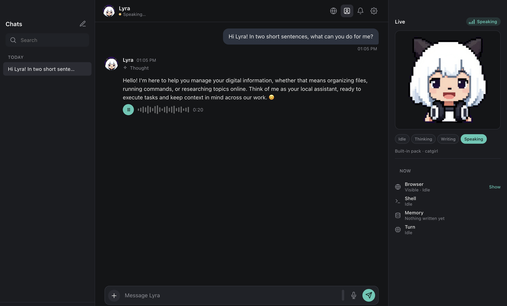

<p align="center">
  
</p>

<h1 align="center">Lyra AI Agent</h1>

<p align="center">
  <b>An AI agent that lives on your computer.</b><br>
  Local models, real tools, a memory, a face, a voice, and the ability to grow itself.
</p>

<p align="center">
  <a href="LICENSE"></a>
  <a href="https://github.com/mhndhayek/LyraAI/actions/workflows/ci.yml"></a>
  
  
  
  <a href="https://github.com/sponsors/mhndhayek"></a>
</p>

---

Lyra is a desktop app. She talks to whatever model runtime you already run (LM Studio, llama.cpp, Ollama, or any OpenAI-compatible server), keeps her memory in a database on your disk, and does things: reads and writes files, runs commands, drives a browser you can watch, generates images, speaks, listens, and reaches your phone over your own private network. Nothing leaves your machine unless you point her at a server somewhere else.

She is also built to change herself. Ask for an orange theme, a new tool, or a panel that shows your calendar, and she edits the app she is running in, with checkpoints and rollback in case it goes wrong.

<p align="center">
  
</p>

## What she can do

| | |
| --- | --- |
| 🧠 **Any local model** | LM Studio, llama.cpp, Ollama, or any OpenAI-compatible endpoint. Separate presets for the brain and the vision model. Context length is read from the server and shown live under the message box. |
| 💾 **A memory of her own** | Long-term memory across chats and short-term notes per chat, in SQLite on your disk. Only Lyra writes to it. |
| 🛠️ **Real tools, with a gate** | Files, shell, code, browser, web search, images, notifications. Risky actions ask first; you decide how much she may do alone. |
| 🌐 **A browser you can watch** | She browses inside the app. Take over when you want, hand it back when you are done. |
| 🎨 **Image generation** | SwarmUI or ComfyUI on your machine or your network. She picks the model and size when you let her. |
| 🗣️ **Voice** | KittenTTS voices and Whisper transcription run in a local sidecar. Send voice notes, hear replies. |
| 👥 **More than one of her** | Profiles: each with her own soul, look, voice, animation, goals and model, and her own chats and memory. Switch and the whole app becomes her. |
| 🎭 **A face** | Eight built-in pixel-art characters that blink, think, type and talk, or bring your own GIF pack or Live2D model. |
| 🎯 **Goals** | After a chat, she reflects and writes goals for herself. Let her work on them in her own time, or archive them. |
| 📱 **On your phone** *(beta)* | Scan a QR code and Safari opens the same chats over HTTPS on your Tailscale network. No account, no cloud. |
| 🧬 **Self-extending** | Themes, UI changes, new tools and panels, applied live with git checkpoints and automatic rollback. |
| 🧩 **Themes** | Not just colors: a theme can change fonts, shapes and the character. The Pixel theme turns the whole app into pixel art. |
| 🪵 **Honest logs** | Every failure is logged. Lyra can read her own log, so you can ask her why something broke. |

## Meet the cast

<p align="center">
  
</p>

<p align="center">
  Lyra &nbsp;·&nbsp; Fox girl &nbsp;·&nbsp; Cowboy &nbsp;·&nbsp; Agent &nbsp;·&nbsp; Butterbot &nbsp;·&nbsp; Succubus &nbsp;·&nbsp; Dapper &nbsp;·&nbsp; Silver
</p>

Every character has idle variations and a thinking, writing and speaking animation. They were drawn with SwarmUI and animated with the pipeline in [`scripts/make_character.py`](scripts/make_character.py). The full recipe, prompts included, is in [docs/AVATARS.md](docs/AVATARS.md), and Lyra can read it herself and draw a new character for you — that part is **beta**: the frames come out clean, but the animation is not always smooth yet.

## Quick start

You need **macOS, Windows or Linux**, **Node.js 20 or newer** (22+ to store chats in SQLite rather than JSON), and a model runtime. [LM Studio](https://lmstudio.ai/) is the easiest: install it, download a model, start its server. llama.cpp and Ollama work just as well.

```bash
git clone https://github.com/mhndhayek/LyraAI.git
cd LyraAI
npm install
npm start
```

Then open **Settings › Model**, pick your model, and say hello.

Optional pieces:

```bash
npm run voice:setup    # KittenTTS + Whisper sidecar (needs uv and espeak-ng: `brew install espeak-ng` on macOS, `apt install espeak-ng` on Linux)
npm run qa             # the full quality gate: lint, tests, self-test, smoke test
npm run selftest       # breaks the app on purpose and proves the safety nets catch it
```

The first start opens a short setup guide: the model, her name and look, voice, image generation, safety and tools. Skip it if you like; it is all under Settings, and the guide is there too under About.

### Building an installer

```bash
npm run dist:mac       # .dmg and .zip, Apple Silicon and Intel
npm run dist:win       # NSIS installer and a portable .exe
npm run dist:linux     # .AppImage, .deb and .tar.gz
```

Builds land in `dist/`. Each platform builds on its own kind of machine; CI builds
all three on every pull request, and publishes them as a GitHub release whenever the
version in `package.json` changes on `main`.

The builds are not signed with an Apple or Microsoft certificate yet. Those cost money, and paying for them is what [sponsoring Lyra](https://github.com/sponsors/mhndhayek) goes towards. Until then:

- **macOS** builds carry an ad-hoc signature. The first time you open `Lyra.app`, macOS says it could not verify the app. Close that, open **System Settings → Privacy & Security**, scroll down to the notice about Lyra and click **Open Anyway**. On macOS 14 and earlier, right-click the app and choose **Open** instead. If you see *"Lyra is damaged and can't be opened"*, that is a download from before the builds were signed; clear the quarantine flag and it opens:

  ```sh
  xattr -dr com.apple.quarantine /Applications/Lyra.app
  ```

- **Windows**: SmartScreen shows "More info → Run anyway" on the first launch of the installer.

## Talk to her from your phone *(beta)*


Lyra can serve the same chats to your phone without any cloud in between.

1. Install [Tailscale](https://tailscale.com/download) on the computer running Lyra and on the phone, signed in to the same account, and enable HTTPS in the Tailscale admin console (DNS tab).
2. Open **Settings › Mobile** and switch on **Phone access**. Lyra asks Tailscale for a real certificate, so the phone gets a proper `https://` page, which is what lets Safari use the microphone and install to the home screen.
3. Point the phone camera at the QR code. Safari opens and pairs in one step. Then **Share › Add to Home Screen**.

The server binds to your Tailscale address only, never to wifi or the internet. Each phone gets its own token you can revoke. Risky tools (shell, code, editing the app) are refused from a phone unless you allow them.

## She can change herself

Lyra is split into a small read-only **kernel** and editable **organs**. The kernel boots the app, keeps settings and data, and takes git checkpoints of everything the agent may touch. The organs are the app you see: the chat, the tools, the settings pages. Lyra edits the live copies, verifies them in a throwaway process, then hot-swaps them or reloads the window. If the new version fails to come up, the kernel rolls back to the last known good checkpoint. Three bad starts in a row open a recovery screen.

Some things she can never change: her own name, the safety settings, your provider keys, and the master tool switches. Model changes wait until she is idle, so she cannot swap her own brain mid-thought.

New abilities usually land as **extensions**: a folder with a manifest, a `main.js` that exports tools, and an optional `panel.html` shown as a tab in the Live panel. Capabilities are approved once; an extension that keeps failing is quarantined. There is a worked example in [docs/examples/hello-panel](docs/examples/hello-panel).

Things people ask her for:

- *"Make the accent color orange and give the buttons sharper corners."*
- *"Add a tool that reads my Downloads folder and tells me what is new."*
- *"Draw yourself as a fox and use that as your picture."*
- *"Why did the voice stop working last night?"* (she reads the log)

## Privacy

Chats, memory, files and settings stay on your machine — `~/Library/Application Support/Lyra` on macOS, `%APPDATA%\Lyra` on Windows, `~/.config/Lyra` on Linux. Lyra sends prompts only to the model endpoint you configure, and images only to the image server you configure. Phone access rides on your own Tailscale network. There is no telemetry, no account, and no server of ours anywhere.

## Docs

- [User guide](docs/GUIDE.md), the long version of every page in Settings.
- [docs/AGENT.md](docs/AGENT.md), what Lyra reads before changing the app.
- [docs/ORGANS.md](docs/ORGANS.md), [docs/EXTENSIONS.md](docs/EXTENSIONS.md), [docs/RECOVERY.md](docs/RECOVERY.md), [docs/AVATARS.md](docs/AVATARS.md).
- [THIRD_PARTY.md](THIRD_PARTY.md), the projects Lyra is built on.

## Support Lyra

Lyra is free and made in spare time. If she has earned a place on your desk, a coffee keeps her growing.

<p align="center">
  <a href="https://github.com/sponsors/mhndhayek"></a>
</p>

A star on the repo helps too, and so does telling a friend who runs local models.

## License

Lyra AI Agent is released under the [PolyForm Noncommercial License 1.0.0](LICENSE).

- ✅ Free to use, copy, change and share for personal, educational, research and other noncommercial purposes.
- ❌ Not for commercial use without permission. If you want to use Lyra in a business or a product, [open an issue](https://github.com/mhndhayek/LyraAI/issues) and let's talk.

Copyright © 2026 mhndhayek.

## Contributing

Run `npm run qa` before opening a pull request: it runs the same gate CI does — lint, the test suite, the kernel self-test and a smoke test of the real app. See [CONTRIBUTING.md](CONTRIBUTING.md) and [docs/QA.md](docs/QA.md).

Installers for macOS, Windows and Linux are built by CI on every pull request. Bumping the version in `package.json` on `main` publishes them as a release — see [docs/QA.md](docs/QA.md).
