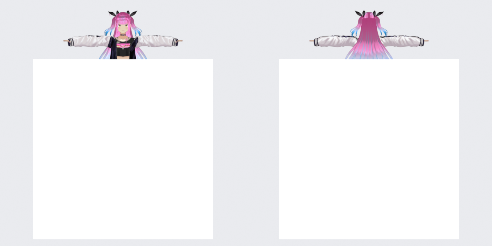

# Lyra in 3D (VRM)



`lyra.vrm` is Lyra's 3D model, made to be the mascot. It is a VRM 0.x avatar with a full humanoid rig (55 bones), 11 spring-bone groups for hair and clothes, and 15 expressions (blink, the vowels for lip sync, joy, anger, sorrow, fun…), so any VRM app (VSeeFace, VTube Studio, Project AIRI, three-vrm) can animate it.

| | |
| --- | --- |
| Hair | hot pink at the crown into sky blue at the tips, with thin cyan streaks; bangs stay pink |
| Eyes | gold |
| Skin | warm tan (#e1bda2), with a subtle painted blush on the cheeks |
| Outfit | varsity bomber, crop top, pink pleated skirt, star ribbon bows |
| File | `lyra.vrm`, 16.7 MB, sha256 `a22f069b47871bf77945cdc1686d2b1f8c2952eee335fa046b37d768f964d5c5` |

The app shows her when the live panel is switched to **3D** (or *Appearance › Live character › Source › 3D*). The renderer is `renderer/character.js` (`mountVrm`), using three.js and @pixiv/three-vrm from `renderer/vendor/three-vrm.min.js`. That bundle is built from `renderer/vendor/three-vrm.entry.js` with esbuild (three 0.180, @pixiv/three-vrm 3.5.5):

```sh
npm i three@0.180 @pixiv/three-vrm@3.5.5 esbuild
npx esbuild renderer/vendor/three-vrm.entry.js --bundle --minify --format=iife --legal-comments=eof --target=chrome120 --outfile=renderer/vendor/three-vrm.min.js
```

In the app she breathes, blinks, glances around, leans in while writing, tilts her head and looks aside while thinking, and opens her mouth with the voice level when speaking. The hair and skirt use the model's own spring bones.

## Where she comes from, and the licence

Lyra is a recolour of **AvatarSample_B** by the **VRoid Project** (pixiv). That sample is published under the VRoid Hub conditions embedded in the file:

- anyone may use it as an avatar, and personal and corporate commercial use is allowed
- modification and redistribution are allowed
- credit is not required (we give it anyway)

Those conditions stay embedded in `lyra.vrm`, and they apply to anyone who takes the model from this repo. The licence for the rest of the app (PolyForm Noncommercial) does **not** narrow them: the model is the VRoid Project's work under its own terms, recoloured.

What was changed: the skin was darkened to a warm tan (median #e1bda2) with a subtle blush painted on both cheeks, and the hair, eyebrows and the painted hair cap were recoloured. The mesh, rig, spring bones and expressions are untouched.

Do not replace this file with a model from BOOTH or other stores without reading its licence first. Most of them are `Redistribution_Prohibited`, and putting one in a public repo breaks that.

## Remaking or tweaking her

`tools/` holds the scripts that made her. The full rebuild needs Blender; the colour pass works without it:

1. In headless Blender with the [VRM add-on](https://extensions.blender.org/add-ons/vrm/), import `AvatarSample_A.vrm` and `AvatarSample_B.vrm` and save every image to `texA/` and `texB/`.
2. `python tools/paint.py pinkblue` (needs numpy and Pillow) paints the new textures into `out_pinkblue/`. The colours are hex codes in the `PAL` table at the top. `goldblue` is the other palette that was tried.
3. `blender -b --python tools/build.py -- AvatarSample_B.vrm out_pinkblue $PWD/lyra` swaps the textures in, renders front, back and bust previews, and exports `lyra.vrm` and `lyra.blend`.

To re-tune only the skin tone, blush, brows and mouth (no Blender): `python tools/repack_vrm.py [in.vrm] [out.vrm]` decodes the textures packed inside the current VRM, applies the same colour pass as `paint.py`, and re-packs a new VRM. `python tools/measure.py [in.vrm]` then checks the result: the median face skin must read #e1bda2 within +/-3, or the gate fails. The shared colour maths (sRGB/linear, the skin mask, the skin darkening, the blush) lives in `tools/common.py`, imported by both `paint.py` and `repack_vrm.py`, so the two paths can never drift.

Two details are easy to miss. The skin is copied from AvatarSample_A's own painted skin wherever both models are bare skin, because a plain colour gain leaves the darker tan in the shaded neck. And the short top locks get a separate pink-only material, so the blue tips never land on the bangs at eye level.
